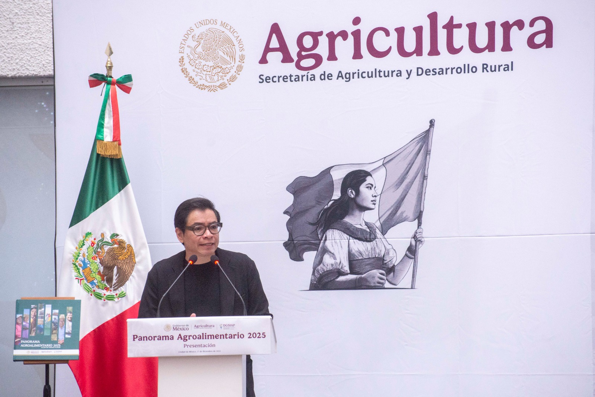
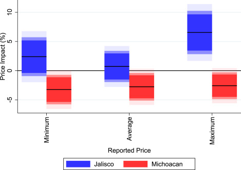

::::: {.hero}

:::: {.hero-left}

::: {.hero-socials}
[<i class="bi bi-github"></i>](https://github.com/rojasirvin){target="_blank" title="GitHub"}

[](https://scholar.google.com/citations?hl=es&user=FUwdSTMAAAAJ&view_op=list_works&sortby=pubdate){target="_blank" title="Google Scholar"}

[<i class="bi bi-envelope-fill"></i>](mailto:irvin.rojas@cide.edu){title="Correo"}

[<i class="bi bi-linkedin"></i>](https://www.linkedin.com/in/rojasirvin/){target="_blank" title="LinkedIn"}
:::

::: {.hero-content}

[Irvin Rojas]{.hero-title}

[Profesor-investigador · CIDE]{.hero-subtitle}

[Investigador en temas de desarrollo económico, incluyendo evaluación de políticas públicas, agricultura, migración y cambio climático. En el CIDE, enseño cursos de inferencia causal y econometría aplicada. He sido consultor para la FAO, el Banco Mundial, el Programa Mundial de Alimentos y otros organismos. Fui funcionario del Gobierno de México.]{.hero-desc}

[Contáctame <i class="bi bi-arrow-right"></i>](mailto:irvin.rojas@cide.edu){.hero-btn}

:::

::::

:::: {.hero-right}
{.hero-img fig-alt="Irvin Rojas"}
::::

:::: {.hero-scroll}
[<i class="bi bi-mouse"></i> Desliza hacia abajo <i class="bi bi-arrow-down hero-scroll-arrow"></i>](#ultima-publicacion){.scroll-link}
::::

:::::

::: {#ultima-publicacion .home-section}

## Última publicación

:::: {.columns}

::: {.column width="50%"}

::: {.justify}

En este artículo, en coautoría con Aleks Schaefer (Oklahoma State University), estudiamos los impactos de mercado y las consecuencias no deseadas de la decisión de 2022 de expandir la zona de exclusión fitosanitaria de Estados Unidos para permitir la importación de aguacates del estado de Jalisco, rompiendo el monopolio histórico de Michoacán. Los resultados principales indican que, si bien la expansión fue inequívocamente beneficiosa para los consumidores estadounidenses al reducir precios y aumentar el volumen de importación, los efectos en México fueron heterogéneos: se observó una caída en los precios domésticos de los aguacates de Michoacán y un aumento en los de alta gama de Jalisco, pero, más críticamente, el cambio en la estructura de incentivos económicos parece haber alterado las dinámicas del crimen organizado y la violencia relacionada con cárteles en ambas regiones productoras.

Rojas, I., \& Schaefer, K. A. (2024). ["Expanding the phytosanitary exclusion zone for Mexican avocados: Market impacts and unintended consequences."](https://www.sciencedirect.com/science/article/pii/S0306919224001490?casa_token=klFCmKi8oeYAAAAA:PxyG3JCyC-vIVouimfqlgewf3fFfjFqQX2WZRBZpUCLKFcF8Yt-9-H4Xogv_t1AZFB6OAJ7JW6s){target="_blank"} *Food Policy*, 129, 102738.

[Ver todas las publicaciones <i class="bi bi-arrow-right"></i>](publications.qmd){.text-btn}

:::

:::

::: {.column width="5%"}
<!-- empty column to create gap -->
:::

::: {.column width="45%"}

{.lightbox fig-align="center"}

:::

::::

:::

::: {.home-section}

## Cursos

[Inferencia Causal](https://rojasirvin.github.io/evaluacion-de-programas/){target="_blank"} — Maestría en Economía del CIDE

[Econometría Aplicada y Ciencia de Datos](https://rojasirvin.github.io/econometria-ii/){target="_blank"} — Licenciatura y Maestría en Economía del CIDE

[Ver docencia <i class="bi bi-arrow-right"></i>](teaching.qmd){.text-btn}

:::

::: {.home-section}

## Apariciones en medios

<iframe class="media-embed" src="https://www.youtube.com/embed/UbHb4oqYRXI?si=EG9zuV1liNmDW-4J&amp;start=649" title="YouTube video player" frameborder="0" allow="accelerometer; autoplay; clipboard-write; encrypted-media; gyroscope; picture-in-picture; web-share" referrerpolicy="strict-origin-when-cross-origin" allowfullscreen></iframe>

[Ver medios <i class="bi bi-arrow-right"></i>](media.qmd){.text-btn}

:::
