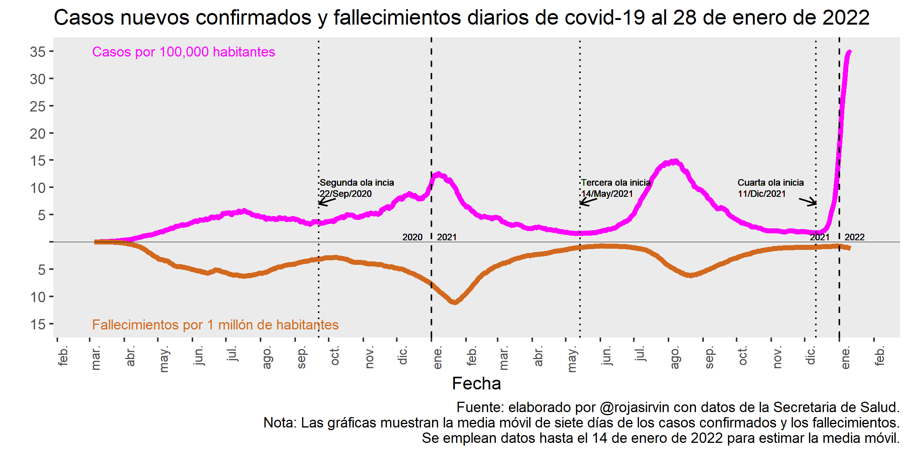
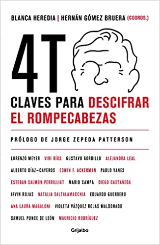
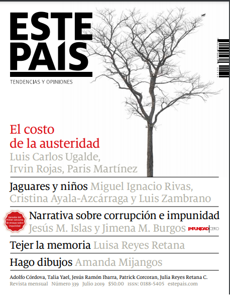

Apariciones en medios, textos y participación en foros y conferencias.

:::::: {.media-wide}

::::: {.media-grid}

:::: {.media-col}

## Audiovisuales

::: {.media-card}
[{fig-alt="Propuestas de las candidatas en materia económica"}](https://www.youtube.com/watch?v=UbHb4oqYRXI&t=649s){.media-thumb .is-video target="_blank"}

[NMás · Es la Hora de Opinar · may 2024]{.media-meta}

[Propuestas de las candidatas en materia económica](https://www.youtube.com/watch?v=UbHb4oqYRXI&t=649s){.media-title target="_blank"}
:::

::: {.media-card}
[{fig-alt="¿Cuál es el plan económico de Claudia Sheinbaum?"}](https://www.youtube.com/watch?v=zJo_yd3PboE){.media-thumb .is-video target="_blank"}

[Expansión · Cuéntame de Economía · abr 2024]{.media-meta}

[¿Cuál es el plan económico de Claudia Sheinbaum?](https://www.youtube.com/watch?v=zJo_yd3PboE){.media-title target="_blank"}
:::

::: {.media-card}
[{fig-alt="Avanza Morena en el Estado de México"}](https://www.youtube.com/watch?v=yCP6V-GJuNY){.media-thumb .is-video target="_blank"}

[Sentido Común · Áreas Comunes · jun 2023]{.media-meta}

[Avanza Morena en el Estado de México](https://www.youtube.com/watch?v=yCP6V-GJuNY){.media-title target="_blank"}
:::

::: {.media-card}
[{fig-alt="El Paquete contra la Inflación y el acceso a alimentos de los más pobres"}](https://www.youtube.com/watch?v=33rFfB-6tNQ){.media-thumb .is-video target="_blank"}

[CIDE · Entrevista · ago 2022]{.media-meta}

[El Paquete contra la Inflación y el acceso a alimentos de los más pobres](https://www.youtube.com/watch?v=33rFfB-6tNQ){.media-title target="_blank"}
:::

::: {.media-card}
[{fig-alt="Reparto de utilidades"}](https://www.youtube.com/watch?v=c0RcDs5B1JA){.media-thumb .is-video target="_blank"}

[Capital 21 · Economía con Sazón · jul 2022]{.media-meta}

[Reparto de utilidades](https://www.youtube.com/watch?v=c0RcDs5B1JA){.media-title target="_blank"}
:::

::: {.media-card}
[{fig-alt="Reforma eléctrica. Transición energética: ¿desarrollo o especulación?"}](https://www.youtube.com/watch?v=R51HeaITHpU){.media-thumb .is-video target="_blank"}

[Capital 21 · Jueves de Debate · feb 2022]{.media-meta}

[Reforma eléctrica. Transición energética: ¿desarrollo o especulación?](https://www.youtube.com/watch?v=R51HeaITHpU){.media-title target="_blank"}
:::

::: {.media-card}
[{fig-alt="Inflación, poder adquisitivo y salarios: retos para 2022"}](https://www.youtube.com/watch?v=fuuX_PdaX8U){.media-thumb .is-video target="_blank"}

[Meganoticias · ene 2022]{.media-meta}

[Inflación, poder adquisitivo y salarios: retos para 2022](https://www.youtube.com/watch?v=fuuX_PdaX8U){.media-title target="_blank"}
:::

::: {.media-card}
[{fig-alt="Lo mejor del ciclo «La clase media en México»"}](https://www.youtube.com/watch?v=0M20T4pTmTc){.media-thumb .is-video target="_blank"}

[Capital 21 · Jueves de Debate · oct 2021]{.media-meta}

[Lo mejor del ciclo «La clase media en México»](https://www.youtube.com/watch?v=0M20T4pTmTc){.media-title target="_blank"}
:::

::: {.media-card}
[{fig-alt="Las clases medias y su papel en la sociedad mexicana"}](https://www.youtube.com/watch?v=YkgjVEk_R-4){.media-thumb .is-video target="_blank"}

[Capital 21 · Jueves de Debate · sep 2021]{.media-meta}

[Las clases medias y su papel en la sociedad mexicana](https://www.youtube.com/watch?v=YkgjVEk_R-4){.media-title target="_blank"}
:::

::: {.media-card}
[{fig-alt="Evolución de la economía nacional"}](https://www.youtube.com/watch?v=IGBc3dDKpRc){.media-thumb .is-video target="_blank"}

[Capital 21 · Informe Capital · jul 2021]{.media-meta}

[Evolución de la economía nacional](https://www.youtube.com/watch?v=IGBc3dDKpRc){.media-title target="_blank"}
:::

::: {.media-card}
[{fig-alt="Análisis de la jornada electoral del 6 de junio"}](https://www.youtube.com/watch?v=0xNoyOtX3Fw){.media-thumb .is-video target="_blank"}

[Democracia Deliberada · jun 2021]{.media-meta}

[Análisis de la jornada electoral del 6 de junio](https://www.youtube.com/watch?v=0xNoyOtX3Fw){.media-title target="_blank"}
:::

::: {.media-card}
[{fig-alt="Reactivación económica: estrategias en la cuesta"}](https://www.youtube.com/watch?v=KgujKpm8yp4){.media-thumb .is-video target="_blank"}

[Capital 21 · Economía con Sazón · feb 2021]{.media-meta}

[Reactivación económica: estrategias en la cuesta](https://www.youtube.com/watch?v=KgujKpm8yp4){.media-title target="_blank"}
:::

::: {.media-card}
[{fig-alt="Razones de la crisis alimentaria"}](https://www.youtube.com/watch?v=wTlrt9cQ4Kw){.media-thumb .is-video target="_blank"}

[Capital 21 · Economía con Sazón · dic 2020]{.media-meta}

[Razones de la crisis alimentaria](https://www.youtube.com/watch?v=wTlrt9cQ4Kw){.media-title target="_blank"}
:::

::: {.media-card}
[{fig-alt="Comentario sobre la nueva secretaria de Educación Pública"}](https://www.youtube.com/watch?v=fYKLYr6jLIw){.media-thumb .is-video target="_blank"}

[Capital 21 · Informe Capital · dic 2020]{.media-meta}

[Comentario sobre la nueva secretaria de Educación Pública](https://www.youtube.com/watch?v=fYKLYr6jLIw){.media-title target="_blank"}
:::

::: {.media-card}
[{fig-alt="Justicia fiscal, la antigua asimetría tributaria"}](https://www.youtube.com/watch?v=MyfjlptL6RI){.media-thumb .is-video target="_blank"}

[Capital 21 · Economía con Sazón · sep 2020]{.media-meta}

[Justicia fiscal, la antigua asimetría tributaria](https://www.youtube.com/watch?v=MyfjlptL6RI){.media-title target="_blank"}
:::

::: {.media-card}
[{fig-alt="Rezagos y causas de la seguridad alimentaria"}](https://www.youtube.com/watch?v=Ff7FRfG54NI){.media-thumb .is-video target="_blank"}

[Capital 21 · Economía con Sazón · sep 2020]{.media-meta}

[Rezagos y causas de la seguridad alimentaria](https://www.youtube.com/watch?v=Ff7FRfG54NI){.media-title target="_blank"}
:::

::: {.media-card}
[{fig-alt="Presupuesto de salud durante la emergencia del COVID"}](https://www.youtube.com/watch?v=3UGnXfJIhiw){.media-thumb .is-video target="_blank"}

[La Octava · mar 2020]{.media-meta}

[Presupuesto de salud durante la emergencia del COVID](https://www.youtube.com/watch?v=3UGnXfJIhiw){.media-title target="_blank"}
:::

::: {.media-card}
[{fig-alt="«Proyectos de gobierno de AMLO generarán inversión productiva»"}](https://www.youtube.com/watch?v=QNtRzkUJX98){.media-thumb .is-video target="_blank"}

[El Financiero Bloomberg · dic 2018]{.media-meta}

[«Proyectos de gobierno de AMLO generarán inversión productiva»](https://www.youtube.com/watch?v=QNtRzkUJX98){.media-title target="_blank"}
:::

::: {.media-card}
[{fig-alt="La iniciativa para reformar el sistema de pensiones"}](https://www.youtube.com/watch?v=KRzVyxjWpak){.media-thumb .is-video target="_blank"}

[El Financiero Bloomberg · nov 2018]{.media-meta}

[La iniciativa para reformar el sistema de pensiones](https://www.youtube.com/watch?v=KRzVyxjWpak){.media-title target="_blank"}
:::

::: {.media-card .media-series}
[Sentido Común · Columnas Plebeyas]{.media-meta}

- [El presupuesto 2024, nuevas inercias](https://www.youtube.com/watch?v=hg52Git6b5s){target="_blank"} [sep 2023]{.media-date}
- [Los otros datos de la oposición](https://www.youtube.com/watch?v=y1wwYwLleC4){target="_blank"} [ago 2023]{.media-date}
- [Agenda económica de mitad de año](https://www.youtube.com/watch?v=ZSS22uH6VBA){target="_blank"} [jul 2023]{.media-date}
- [Renunciar a hacer política en la derrota](https://www.youtube.com/watch?v=0VRolItTQqA){target="_blank"} [jun 2023]{.media-date}
- [Dinastía y partido enlazados rumbo al ocaso](https://www.youtube.com/watch?v=93EKVgahXa0){target="_blank"} [may 2023]{.media-date}
- [Duras pruebas para ideólogos del Edoméx](https://www.youtube.com/watch?v=VrCUyfeW3JE){target="_blank"} [abr 2023]{.media-date}
- [Pobreza laboral: brechas regionales y de género](https://www.youtube.com/watch?v=3Ji9JPO7MyM){target="_blank"} [mar 2023]{.media-date}
- [Desglobalización y política industrial](https://www.youtube.com/watch?v=ENGTLQPQV_4){target="_blank"} [feb 2023]{.media-date}
- [Tres indicadores para navegar el 2023](https://www.youtube.com/watch?v=ojfD_I0pzzc){target="_blank"} [ene 2023]{.media-date}
- [México en Qatar, un reflejo de su élite empresarial](https://www.youtube.com/watch?v=DTiYNKHZivw){target="_blank"} [dic 2022]{.media-date}
- [El neoliberalismo no tiene dogmas y otros cuentos desde la cripta](https://www.youtube.com/watch?v=AGgxCN4g4XI){target="_blank"} [nov 2022]{.media-date}
- [Cuidado con el horóscopo de la sucesión](https://www.youtube.com/watch?v=xLSb155Ldg8){target="_blank"} [oct 2022]{.media-date}
- [No digas M\*\*x](https://www.youtube.com/watch?v=iYtIikkRN4c){target="_blank"} [sep 2022]{.media-date}
:::

::::

:::: {.media-col}

## Escritos

::: {.media-card .media-series}
[El Universal · Opinión]{.media-meta}

- [El segundo piso de la 4T en el campo](https://www.eluniversal.com.mx/opinion/irvin-rojas/el-segundo-piso-de-la-4t-en-el-campo/){target="_blank"} [mar 2024]{.media-date}
- [Reformas, proyectos y Diálogos por la Transformación](https://www.eluniversal.com.mx/opinion/irvin-rojas/reformas-proyectos-y-dialogos-por-la-transformacion/){target="_blank"} [feb 2024]{.media-date}
- [El país de la oposición](https://www.eluniversal.com.mx/opinion/irvin-rojas/el-pais-de-la-oposicion/){target="_blank"} [ene 2024]{.media-date}
- [La utopía de Clara](https://www.eluniversal.com.mx/opinion/irvin-rojas/la-utopia-de-clara/){target="_blank"} [dic 2023]{.media-date}
- [Los mensajes en el inicio de los Diálogos por la Transformación](https://www.eluniversal.com.mx/opinion/irvin-rojas/los-mensajes-en-el-inicio-de-los-dialogos-por-la-transformacion/){target="_blank"} [dic 2023]{.media-date}
- [Claudia Sheinbaum, con el bastón por el mango](https://www.eluniversal.com.mx/opinion/irvin-rojas/claudia-sheinbaum-con-el-baston-por-el-mango/){target="_blank"} [nov 2023]{.media-date}
- [Cambio climático y la adaptación en medio de la incertidumbre](https://www.eluniversal.com.mx/opinion/irvin-rojas/cambio-climatico-y-la-adaptacion-en-medio-de-la-incertidumbre/){target="_blank"} [nov 2023]{.media-date}
- [Claudia Goldin: Nobel haciendo historia](https://www.eluniversal.com.mx/opinion/irvin-rojas/claudia-goldin-nobel-haciendo-historia/){target="_blank"} [oct 2023]{.media-date}
- [Doble rasero para Xóchitl](https://www.eluniversal.com.mx/opinion/irvin-rojas/doble-rasero-para-xochitl/){target="_blank"} [sep 2023]{.media-date}
- [Claudia Sheinbaum, candidata de la continuidad](https://www.eluniversal.com.mx/opinion/irvin-rojas/claudia-sheinbaum-candidata-de-la-continuidad/){target="_blank"} [sep 2023]{.media-date}
- [No quedó nada ciudadano ni renovador en el Frente](https://www.eluniversal.com.mx/opinion/irvin-rojas/no-quedo-nada-ciudadano-ni-renovador-en-el-frente/){target="_blank"} [ago 2023]{.media-date}
- [Reducción histórica de la pobreza en México](https://www.eluniversal.com.mx/opinion/irvin-rojas/reduccion-historica-de-la-pobreza-en-mexico/){target="_blank"} [ago 2023]{.media-date}
- [Una mirada panorámica a los resultados de la ENIGH](https://www.eluniversal.com.mx/opinion/irvin-rojas/una-mirada-panoramica-a-los-resultados-de-la-enigh/){target="_blank"} [jul 2023]{.media-date}
:::

::: {.media-card}
[{fig-alt="Comparación de las olas de contagio de covid-19 en México"}](https://rioarriba.mx/articulo.php?iden=comparacion-de-las-olas-de-contagio-de-covid19-en-mexico){.media-thumb target="_blank"}

[Río Arriba · ene 2022]{.media-meta}

[Comparación de las olas de contagio de covid-19 en México](https://rioarriba.mx/articulo.php?iden=comparacion-de-las-olas-de-contagio-de-covid19-en-mexico){.media-title target="_blank"}
:::

::: {.media-card}
[{fig-alt="Premio Nobel de Economía 2021"}](https://rioarriba.mx/articulo.php?iden=les-hizo-justicia-la-revolucion){.media-thumb target="_blank"}

[Río Arriba · oct 2021]{.media-meta}

[Les hizo justicia la revolución](https://rioarriba.mx/articulo.php?iden=les-hizo-justicia-la-revolucion){.media-title target="_blank"}

Una entrada sobre el Premio Nobel de Economía 2021.
:::

::: {.media-card}
[{fig-alt="Portada de 4T. Claves para descifrar el rompecabezas"}](https://www.amazon.com.mx/dp/6073804032){.media-thumb .is-cover target="_blank"}

[Capítulo de libro · Grijalbo · 2021]{.media-meta}

[Trabajo, salarios y relaciones laborales](https://www.amazon.com.mx/dp/6073804032){.media-title target="_blank"}

En *4T. Claves para descifrar el rompecabezas*, coordinado por Hernán Gómez y Blanca Heredia. Un capítulo sobre la economía y la política de las reformas en materia laboral de la 4T.
:::

::: {.media-card}
[Nexos · mar 2020]{.media-meta}

[El Covid-19 también es un asunto de clase](https://economia.nexos.com.mx/el-covid-19-tambien-es-un-asunto-de-clase/){.media-title target="_blank"}
:::

::: {.media-card}
[{fig-alt="Portada de Este País 339"}](https://estepais.com/impreso/austeridad-y-eficiencia-entrevista-con-irvin-rojas/){.media-thumb .is-cover target="_blank"}

[Este País · núm. 339 · jul 2019]{.media-meta}

[Austeridad y eficiencia](https://estepais.com/impreso/austeridad-y-eficiencia-entrevista-con-irvin-rojas/){.media-title target="_blank"}

Entrevista sobre las medidas de austeridad del gobierno de Andrés Manuel López Obrador.
:::

::::

:::: {.media-col}

## Varios

::: {.media-card}
[{fig-alt="Foro 7: Inversiones estratégicas para el Bienestar"}](https://www.youtube.com/watch?v=dUjUqTHBPzY){.media-thumb .is-video target="_blank"}

[Foros La Ciudad y la Transformación · may 2023]{.media-meta}

[Foro 7: Inversiones estratégicas para el Bienestar](https://www.youtube.com/watch?v=dUjUqTHBPzY){.media-title target="_blank"}
:::

::: {.media-card}
[{fig-alt="Presentación del libro «4T. Claves para descifrar el rompecabezas»"}](https://www.youtube.com/watch?v=o56qswSCacg){.media-thumb .is-video target="_blank"}

[Democracia Deliberada · may 2021]{.media-meta}

[Presentación del libro «4T. Claves para descifrar el rompecabezas»](https://www.youtube.com/watch?v=o56qswSCacg){.media-title target="_blank"}
:::

::: {.media-card}
[{fig-alt="La enseñanza de la economía en la pandemia"}](https://www.youtube.com/watch?v=Kk3UGvjhs2Q){.media-thumb .is-video target="_blank"}

[Conversaciones CIDE · feb 2021]{.media-meta}

[La enseñanza de la economía en la pandemia](https://www.youtube.com/watch?v=Kk3UGvjhs2Q){.media-title target="_blank"}
:::

::: {.media-card}
[{fig-alt="Los atinos y desatinos en la investigación económica sobre los efectos del COVID-19"}](https://www.youtube.com/watch?v=qwoWWXv4_Sg){.media-thumb .is-video target="_blank"}

[Seminario · ene 2021]{.media-meta}

[Los atinos y desatinos en la investigación económica sobre los efectos del COVID-19](https://www.youtube.com/watch?v=qwoWWXv4_Sg){.media-title target="_blank"}
:::

::: {.media-card}
[{fig-alt="Los salarios en México en tiempos de pandemia"}](https://www.youtube.com/watch?v=QwN4dEXWulY){.media-thumb .is-video target="_blank"}

[Conversaciones CIDE · nov 2020]{.media-meta}

[Los salarios en México en tiempos de pandemia](https://www.youtube.com/watch?v=QwN4dEXWulY){.media-title target="_blank"}
:::

::: {.media-card}
[{fig-alt="Implications of COVID-19 for the Mexico-US Agricultural and Food Markets"}](https://www.youtube.com/watch?v=n4a68FLIuJ4){.media-thumb .is-video target="_blank"}

[MSU Closing Bell · jun 2020]{.media-meta}

[Implications of COVID-19 for the Mexico-US Agricultural and Food Markets](https://www.youtube.com/watch?v=n4a68FLIuJ4){.media-title target="_blank"}
:::

::::

:::::

::::::
